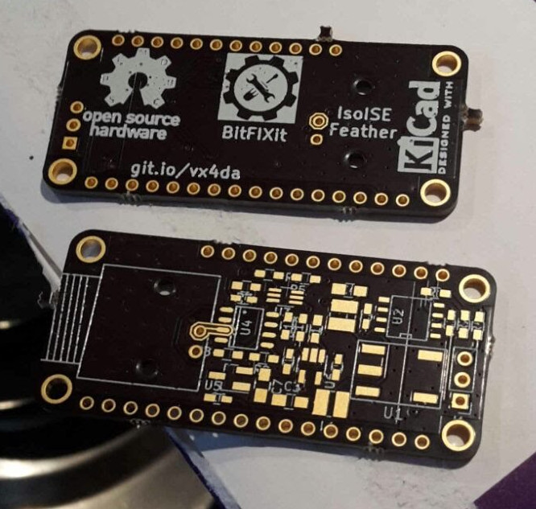

# IsoISE-feather
##Hardware files for IsoISE feather board

In this repo you will find all the design files; I hope it is everything you need to reproduce and hopefully improve my work.

This circuit is heavily based on wonderful work by Ryan Edwards at sparkyswidgets.com.

I emailed Ryan because I wanted to ask if he was happy for me to just make his isoion project, which is not strictly necessary but I think is good manners. He gave me his blessing to go ahead. I thought it was especially important to do this since he was selling his projects (although not this one, my orignal motivation for making it) and I wasn't then intending to modify his design. Subsequently I took the bull by the horns and dove into (partially!) understanding and modifying his designs, so I took his more advanced [ion selective electrode interface project](https://www.sparkyswidgets.com/portfolio-item/ion-selective-electrode-interface/) and went from there.

As you can see by comparing our circuits, I copied his design for the isolated I2C based ADC and digital pot, applied to a TL072 JFET op-amp front end. The only significant changes I made were to replace the isolated power supply and separate -5V generator with an isolated supply able to generate +-5V from 3.3V. I did this because the original ADUM6010 datasheet does not recommend the combination of VIN=3.3V and VOUT=5V.

The PCB layout is my own work, my first ever board produced and already I can see issues!! The guard rings around the signal input pin are very tightly spaced making soldering difficult - in a future revision I will increase the spacing there. I somehow ended up skipping the reference R3 - so there are 11 resistors on board numbered R1-R12. Again, I'll correct this in future revisions. I didn't pay much attention to silkscreen component references so assembly will require reference to the board layout in Kicad....

I'm following Dave Jones' OSHW logo and definition: https://www.eevblog.com/oshw/

S = Schematic - Included
P = PCB - Included
F = Firmware and/or software - TO BE DONE
M = Mechanical CAD files - NOT APPLICABLE
D = Design Documentation - This document
B = Bill Of Materials - Included
C = License used allows for commercial use - YES

I've used open software to produce these files: Kicad 4.0.7, LibreOffice 4.3 and Remarkable 1.87

You can order the revision 1 board at [OSH Park](https://oshpark.com/shared_projects/bHu0gW7W).
Additionally, a shared basket of almost all the required components is [available at digikey](http://www.digikey.co.uk/short/jpfbn8).

Licensed under the Creative Commons Attribution-ShareAlike 3.0 Unported license, following the license of the originating project.