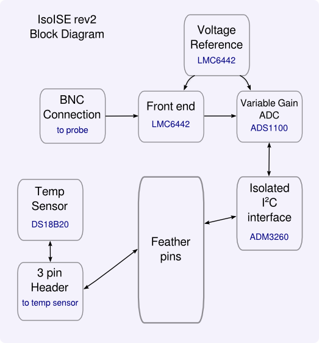

# IsoISE-feather
## Theory of operation

The name IsoISE refers to the main purpose of this board - a fully electrically isolated Ion Selective Electrode (ISE) meter. ISE probes are available to measure the concentration of a range of ions in solution. The most common ISE probe is a pH probe, but probes are available for a range of other ions such as nitrate, ammonia etc. This circuit gives an I^2^C reading corresponding to the voltage of the probe, with variable gain between 1-8x. It also features a connection for a waterproof temperature probe.

The IsoISE-feather uses the feather form factor developed by Lady Ada at [Adafruit](https://www.adafruit.com/) ; they are amazing; they just keep on cranking out great products backed up with libraries, tutorials, etc. Please support them so they can continue their great work. Using the feather format means that the microcontroller can be supplied by the user, together with lcd, buttons etc if desired.

This circuit is based on wonderful work by Ryan Edwards at [sparkyswidgets.com](http://www.sparkyswidgets.com/). Rev1 was heavily based on his original work, with rev 2 I've changed most of the components in an attempt to simplify the circuit and improve accuracy.

 A block diagram of the circuit is given here for reference:

The input signal from the probe arrives at the front end, which is a pair of ultra-low input bias current op-amps.

The signal is passed onto the ADC, which is 16-bit, has programmable gain of 1-8x and features self calibration from the supply voltage. We are using a precision voltage reference to power the ADC as well as provide a reference to the front end.

A digitised value from the ADC is read by the microcontroller across the isolated I^2^C interface. The interface also provides isolated power for the voltage reference and op-amps.

Additionally, a pin header is supplied to allow the connection of a waterproof temperature sensor, the DS18B20. It is widely available and accurate to >0.1&deg;C.